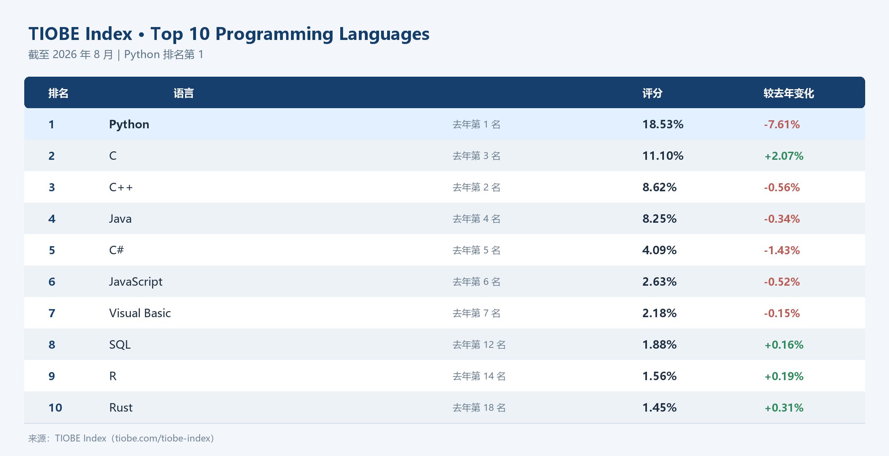
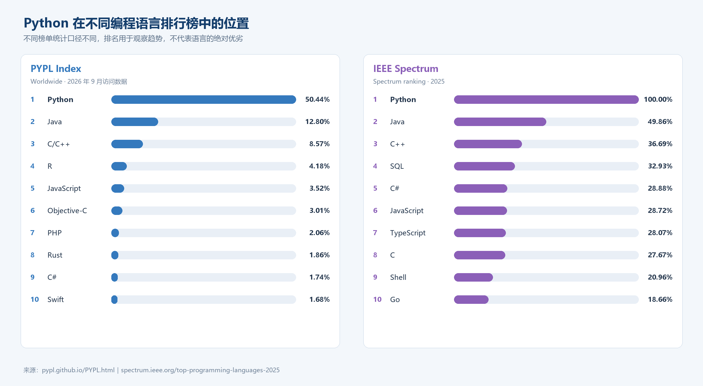
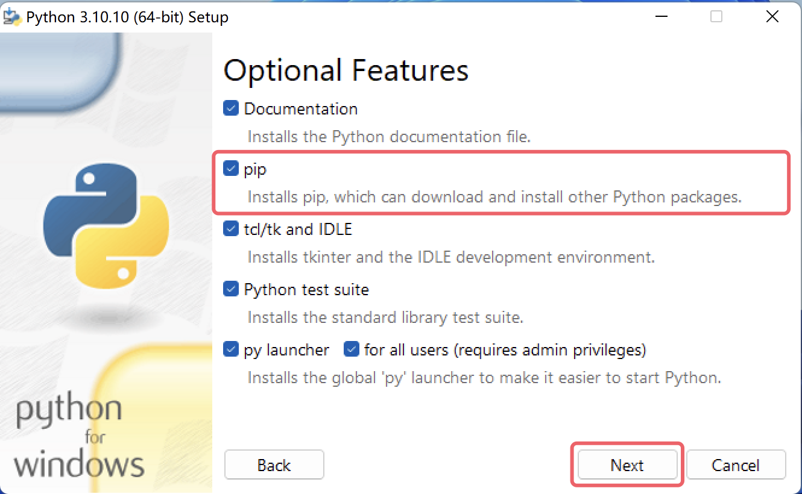
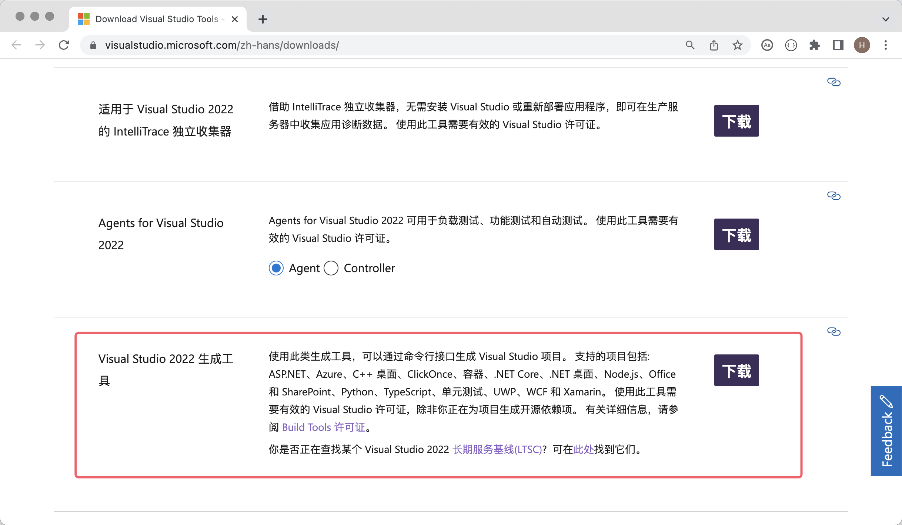
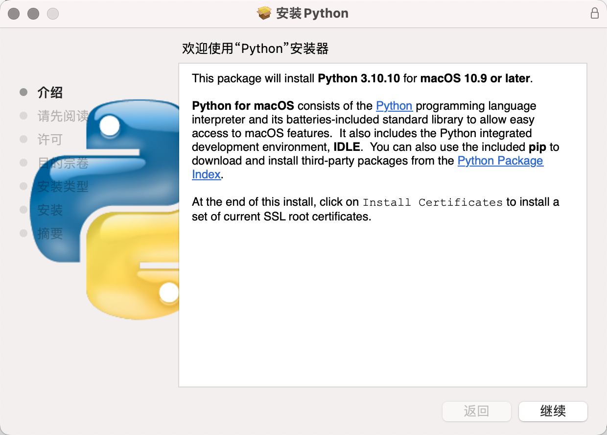

# 01.初识Python

## 初识Python

### Python简介

Python（英式发音：/ˈpaɪθən/；美式发音：/ˈpaɪθɑːn/）是由荷兰人吉多·范罗苏姆（Guido von Rossum）发明的一种编程语言，是目前世界上最受欢迎和拥有最多用户的编程语言。Python 强调代码的可读性和语法的简洁性，相较于 C、C++、Java 这些同样影响深远的编程语言，Python 让使用者能够用更少的代码表达自己的意图。下面展示 TIOBE Index、PYPL Index 和 IEEE Spectrum 的编程语言排名示例。不同榜单采用的统计数据和评价方法不同，更新时间也不完全一致，因此排名结果只能用于观察编程语言的流行趋势，不能简单理解为语言之间的绝对优劣。

#### Python编年史

下面是 Python 语言发展过程中的一些重要时间点：

1. 1989年12月：吉多·范罗苏姆决心开发一个新的脚本语言及其解释器来打发无聊的圣诞节，新语言将作为 ABC 语言的继承者，主要用来替代 Unix shell 和 C 语言实现系统管理。由于吉多本人是 BBC 电视剧《*Monty Python's Flying Circus*》的忠实粉丝，所以他选择了 Python 这个词作为新语言的名字。
2. 1991年02月：吉多·范罗苏姆在 alt.sources 新闻组上发布了 Python 解释器的最初代码，标记为版本0.9.0。
3. 1994年01月：Python 1.0发布，梦开始的地方。
4. 2000年10月：Python 2.0发布，Python 的整个开发过程更加透明，生态圈开始慢慢形成。
5. 2008年12月：Python 3.0发布，引入了诸多现代编程语言的新特性，但并不完全向下兼容。
6. 2011年04月：pip 首次发布，Python 语言有了自己的包管理工具。
7. 2018年07月：吉多·范罗苏姆宣布从“终身仁慈独裁者”（开源项目社区出现争议时拥有最终决定权的人）的职位上“永久休假”。
8. 2020年01月：在 Python 2和 Python 3共存了11年之后，官方停止了对 Python 2的更新和维护，希望用户尽快切换到 Python 3。
9. 目前：Python 在大模型（GPT-3、GPT-4、BERT等）、计算机视觉（图像识别、目标检测、图像生成等）、智能推荐（YouTube、Netflix、字节跳动等）、自动驾驶（Waymo、Apollo等）、语音识别、数据科学、量化交易、自动化测试、自动化运维等领域都得到了广泛的应用，Python 语言的生态圈也是相当繁荣。

> **说明**：大多数软件的版本号一般分为三段，形如A.B.C，其中A表示大版本号，当软件整体重写升级或出现不向后兼容的改变时，才会增加A；B表示功能更新，出现新功能时增加B；C表示小的改动（例如：修复了某个Bug），只要有修改就增加C。

#### Python优缺点

Python 语言的优点很多，简单为大家列出几点。

1. **简单优雅**，跟其他很多编程语言相比，Python **更容易上手**。
2. 能用更少的代码做更多的事情，**提升开发效率**。
3. 开放源代码，拥有**强大的社区和生态圈**。
4. **能够做的事情非常多**，有极强的适应性。
5. **胶水语言**，能够黏合其他语言开发的东西。
6. 解释型语言，更容易**跨平台**，能够在多种操作系统上运行。

Python 最主要的缺点是**执行效率低**（解释型语言的通病），如果更看重代码的执行效率，C、C++ 或 Go 可能是你更好的选择。

### 安装Python环境

工欲善其事，必先利其器。想要开始你的 Python 编程之旅，首先得在计算机上安装 Python 环境，简单的说就是安装运行 Python 程序需要的 Python 解释器。我们推荐大家安装官方的 Python 3 解释器，它是用 C 语言编写的，我们通常也称之为 CPython，它可能是你目前最好的选择。首先，我们需要从官方网站的[下载页面](https://www.python.org/downloads/)找到下载链接，点击“Download”按钮进入下载页面后，需要根据自己的操作系统选择合适的 Python 3安装程序，如下图所示。

进入下载页面后，有些 Python 版本并没有提供 Windows 和 macOS 系统的安装程序，只提供了源代码的压缩文件，对于熟悉 Linux 系统的小伙伴，我们可以通过源代码构建安装；对于使用 Windows 或 macOS 系统的小伙伴，我们还是**强烈建议**使用安装程序。例如，你想安装 Python 3.10，选择 Python 3.10.10 或 Python 3.10.11 就能找到 Windows 或 macOS 系统的安装包，而其他版本可能只有源代码，如下图所示。

#### Windows环境

下面我们以 Windows 11为例，讲解如何在 Windows 操作系统上安装 Python 环境。双击运行从官网下载的安装程序，会打开一个安装向导，如下图所示。

首先，一定要记得勾选“Add python.exe to PATH”选项，它会帮助我们将 Python 解释器添加到 Windows 系统的 PATH 环境变量中（不理解没关系，勾上就对了）；其次，“Use admin privileges when installing py.exe”是为了在安装过程中获得管理员权限，建议勾选。然后，我们选择“Customize Installation”，使用自定义安装的模式，这是专业人士的选择，而你就（假装）是那个专业人士，不建议使用“Install Now”（默认安装）。

接下来，安装向导会提示你勾选需要的“Optional Features”（可选特性），这里咱们可以直接全选。值得一提的是其中的第2项，它是 Python 的包管理工具 pip，可以帮助我们安装三方库和三方工具，所以一定要记得勾选它，然后点击“Next”进入下一环节。

接下来是对“Advanced Options”（高级选项）的选择，这里我们建议大家只勾选“Add Python to environment variables”和“Precompile standard library”这两个选项，前者会帮助我们自动配置好环境变量，后者会预编译标准库（生成`.pyc`文件），这样在使用时就无需临时编译了。还是那句话，不理解没关系，勾上就对了。下面的“Customize install location”（自定义安装路径）**强烈建议**修改为自定义的路径，这个路径中不应该包含中文、空格或其他特殊字符，注意这一点会为你将来减少很多不必要的麻烦。设置完成后，点击“Install”开始安装。

安装成功会出现如下图所示的画面，安装成功的关键词是“successful”，如果安装失败，这里的单词会变成“failed”。

安装完成后可以打开 Windows 的“命令行提示符”或 PowerShell，然后输入`python --version`或`python -V`来检查安装是否成功，这个命令是查看 Python 解释器的版本号。如果看到如下所示的画面，那么恭喜你，Python 环境已经安装成功了。这里我们建议再检查一下 Python 的包管理工具 pip 是否可用，对应的命令是`pip --version`或`pip -V`。

> **说明**：如果安装过程报错或提示安装失败，很有可能是你的 Windows 系统缺失了一些动态链接库文件或缺少必要的构建工具导致的。可以在[微软官网](https://visualstudio.microsoft.com/zh-hans/downloads/)下载“Visual Studio 2022 生成工具”进行修复，如下图所示。如果不方便在微软官网下载的，也可以使用下面的百度云盘链接来获取修复工具，链接: https://pan.baidu.com/s/1iNDnU5UVdDX5sKFqsiDg5Q 提取码: cjs3。
>
> 
>
> 上面下载的“Visual Studio 2022 生成工具”需要联网才能运行，运行后会出现如下图所示的画面，大家可以参考下图勾选对应的选项进行修复。修复过程需要联网下载对应的软件包，这个过程可能会比较耗时间，修复成功后可能会要求重启你的操作系统。
>
> 

#### macOS环境

macOS 安装 Python 环境相较于 Windows 系统更为简单，我们从官方下载的安装包是一个`pkg`文件，双击运行之后不断的点击“继续”就安装成功了，几乎不用做任何的设置和勾选，如下图所示。

安装完成后，可以在 macOS 的“终端”工具中输入`python3 --version`命令来检查是否安装成功，注意这里的命令是`python3`不是`python`！！！然后我们再检查一下包管理工具，输入命令`pip3 --version`，如下图所示。

#### 其他安装方式

有人可能会推荐新手直接安装 [Anaconda](https://www.anaconda.com/download/success)，因为 Anaconda 会帮助我们安装 Python 解释器以及一些常用的三方库，除此之外还提供了一些便捷的工具，特别适合萌新小白。我个人并不推荐这种方式，因为在安装 Anaconda 时你会莫名其妙安装了一大堆有用没用的三方库（占用比较多的硬盘空间），然后你的终端或命令提示符会被 Anaconda 篡改（每次启动自动激活虚拟环境），这些并不符合软件设计的**最小惊讶原则**。其他关于 Anaconda 的小毛病此处就不再赘述了，如果你非要使用 Anaconda，推荐安装 Miniconda，它跟 Anaconda 在同一个下载页面。

还有萌新小白经常会听到或说出，“我要写 Python 程序，安装一个 PyCharm 不就可以了吗？”。这里简单科普一下，PyCharm 只是一个辅助写 Python 代码的工具，它本身并不具备运行 Python 代码的能力，运行 Python 代码靠的是我们上面安装的 Python 解释器。当然，有些 PyCharm 版本在创建 Python 项目时，如果检测不到你电脑上的 Python 环境，也会提示你联网下载 Python 解释器。PyCharm 的安装和使用我们放在了下一课。

### 知识点总结

1. **Python 的基本认识**
   - Python 是一种强调代码可读性、语法简洁、开发效率高的高级编程语言。
   - Python 由吉多·范罗苏姆发明，Python 3 是目前学习和使用的主要版本；Python 2 已于 2020 年停止官方维护。
   - Python 已广泛应用于人工智能、计算机视觉、推荐系统、自动驾驶、语音识别、数据科学、量化交易、自动化测试和自动化运维等领域。

2. **Python 的特点**
   - 优点：简单易学、代码简洁、开发效率高、开源、社区和生态完善、应用范围广、跨平台能力较好。
   - Python 通常被称为“胶水语言”，可以与其他语言或工具协同工作。
   - Python 是解释型语言，使用方便但执行效率通常低于 C、C++、Go 等编译型语言。

3. **Python 版本号**
   - 版本号通常采用 `A.B.C` 的形式：`A` 表示大版本更新，`B` 表示功能更新，`C` 表示修复问题或小幅改动。

4. **Python 环境的组成**
   - 运行 Python 程序需要安装 Python 解释器，官方提供的 CPython 是常用选择。
   - `pip` 是 Python 的包管理工具，用于安装和管理第三方库及工具。
   - PyCharm、Visual Studio Code 等属于编程辅助工具或集成开发环境，本身不能代替 Python 解释器。

5. **Windows 环境安装要点**
   - 安装时应勾选 `Add python.exe to PATH`，并建议启用环境变量配置和标准库预编译选项。
   - 自定义安装路径时，建议不要包含中文、空格或特殊字符。
   - 安装完成后，可在命令提示符或 PowerShell 中使用 `python --version`、`python -V` 检查 Python，使用 `pip --version`、`pip -V` 检查 pip。

6. **macOS 环境安装要点**
   - macOS 通常使用官方下载的 `pkg` 安装包。
   - 安装完成后，在终端中使用 `python3 --version` 检查 Python，使用 `pip3 --version` 检查 pip。

7. **其他安装方式的选择**
   - Anaconda 会一次性安装大量工具和第三方库；如果需要 Conda 环境，入门时可优先考虑更轻量的 Miniconda。
   - 无论使用哪种编辑器或开发环境，都必须先具备可用的 Python 解释器。
