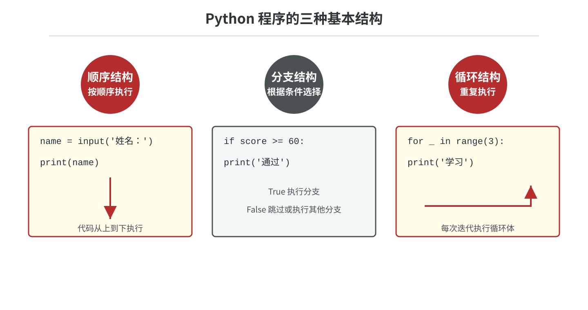
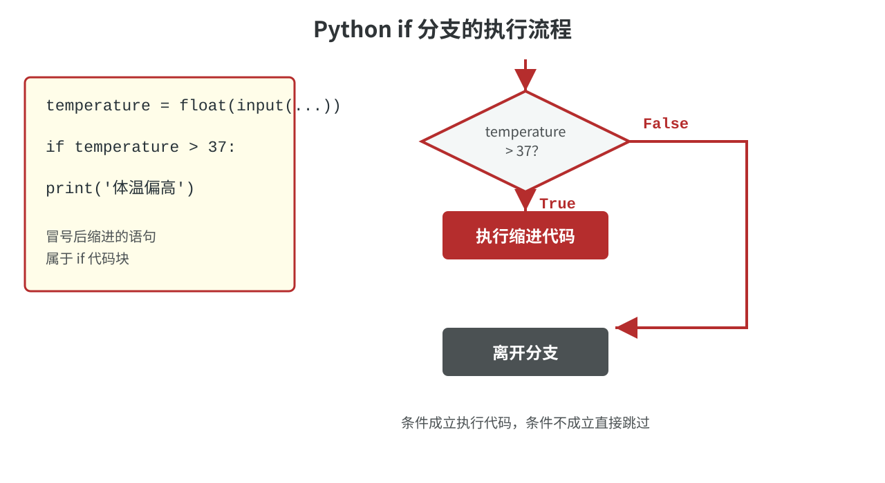

# 05.分支结构

## 分支结构

迄今为止，我们写的 Python 程序都是一条一条语句按顺序向下执行的，这种代码结构叫做顺序结构。然而仅有顺序结构并不能解决所有的问题，比如我们设计一个游戏，游戏第一关的过关条件是玩家获得 1000 分，那么在第一关完成后，我们要根据玩家得到的分数来决定是进入第二关，还是告诉玩家“Game Over”（游戏结束）。在这种场景下，我们的代码就会产生两个分支，而且只有一个会被执行。类似的场景还有很多，我们将这种结构称之为“分支结构”或“选择结构”。给大家一分钟的时间，你应该可以想到至少 5 个以上类似的例子，赶紧试一试吧！

下面这张图把顺序结构、分支结构和循环结构放在一起进行了对比。顺序结构按从上到下的顺序执行，分支结构根据条件选择路径，循环结构则让一段代码重复执行。



### 使用if和else构造分支结构

在 Python 中，构造分支结构最常用的是`if`、`elif`和`else`三个关键字。所谓**关键字**就是编程语言中有特殊含义的单词，很显然你不能够使用它作为变量名。当然，我们并不是每次构造分支结构都会把三个关键字全部用上，我们通过例子加以说明。例如我们要写一个身体质量指数（BMI）的计算器。身体质量质数也叫体质指数，是国际上常用的衡量人体胖瘦程度以及是否健康的一个指标，计算公式如下所示。通常认为 $\small{18.5 \le BMI &lt; 24}$ 是正常范围， $\small{BMI &lt; 18.5}$ 说明体重过轻， $\small{BMI \ge 24}$ 说明体重过重， $\small{BMI \ge 27}$ 就属于肥胖的范畴了。

$$
BMI = \frac{体重}{身高^{2}}
$$

> **说明**：上面公式中的体重以千克（kg）为单位，身高以米（m）为单位。

```python

height = float(input('身高(cm)：'))
weight = float(input('体重(kg)：'))
bmi = weight / (height / 100) ** 2
print(f'{bmi = :.1f}')
if 18.5 <= bmi < 24:
    print('你的身材很棒！')
```

程序运行时会先显示“身高(cm)：”和“体重(kg)：”两个输入提示，用户输入的数据会被`input`函数读取，再由`float`函数转换成浮点数。`print`函数输出计算得到的 BMI；只有当 BMI 落在正常范围内时，缩进的输出语句才会执行。

> **提示**：`if`语句的最后面有一个`:`，它是用英文输入法输入的冒号；程序中输入的`'`、`"`、`=`、`(`、`)`等特殊字符，都是在英文输入法状态下输入的，这一点之前已经提醒过大家了。很多初学者经常会忽略这一点，等到执行代码时，就会看到一大堆错误提示。当然，认真读一下错误提示还是很容易发现哪里出了问题，但是**强烈建议**大家在写代码的时候**切换到英文输入法**，这样可以避免很多不必要的麻烦。

还要特别注意缩进：`if`后面保持4个空格缩进的语句属于`if`代码块，没有缩进的语句已经离开这个分支。一个代码块中的语句必须保持统一缩进，不能一会儿使用4个空格，一会儿使用制表符。

在正式学习 BMI 之前，我们先看两个更贴近日常生活的分支案例。它们的共同点是：先获得一个数据，再根据条件选择是否执行某段代码。

#### 体温检测

要求：输入体温，当体温高于 `37` 摄氏度时给出提醒；如果不超过 `37` 摄氏度，程序不需要额外输出。

```python
temperature = float(input('体温(℃)：'))
if temperature > 37:
    print('体温偏高，请及时复测！')
```

这就是最简单的单分支结构：条件成立时执行缩进代码，条件不成立时直接跳过。下面的图展示了 Python `if` 语句的两条执行路径。



> **提示**：Python 使用冒号和缩进表示代码块，缩进的语句属于当前分支。

#### 余额是否足够

要求：输入钱包余额和待支付金额，余额足够时提示支付成功，否则提示余额不足。

```python
balance = float(input('钱包余额(元)：'))
amount = float(input('支付金额(元)：'))
if balance >= amount:
    print('支付成功！')
else:
    print('余额不足！')
```

这个案例使用了 `if-else` 双分支结构。无论条件结果如何，两个分支中只会执行其中一个，这种结构适合处理“成功或失败”“通过或不通过”这类互斥结果。

上面的代码中，我们在计算和输出 BMI 之后，加上了一段分支结构，如果满足 $\small{18.5 \le BMI &lt; 24}$ ，程序会输出“你的身材很棒！”，但是如果不满足条件，这段输出就没有了。这就是刚才提到的，代码可以有不同的执行路径，有些代码不一定会执行到。我们在`if`关键字的后面给出了一个表达式`18.5 <= bmi < 24`，之前我们说过，关系运算会产生布尔值，如果`if`后面的布尔值为`True`，那么`if`语句下方，有四个空格缩进的`print('你的身材很棒！')`就会被执行。我们先输入几组数据运行上面的代码，如下所示。

第一组输入：

```
身高(cm)：175
体重(kg)：68
bmi = 22.2
你的身材很棒！
```

第二组输入：

```
身高(cm)：175
体重(kg)：95
bmi = 31.0
```

第三组输入：

```
身高(cm)：175
体重(kg)：50
bmi = 16.3
```

只有第一组输入的身高和体重计算出的 BMI 在 18.5 到 24 这个范围值内，所以触发了`if`条件，输出了“你的身材很棒”。需要说明的是，不同于 C、C++、Java 等编程语言，Python 中没有用花括号来构造代码块而是**使用缩进的方式来表示代码的层次结构**，如果`if`条件成立的情况下需要执行多条语句，只要保持多条语句具有相同的缩进就可以了。换句话说，若干行连续的语句如果保持了相同的缩进，那么它们就属于同一个**代码块**，相当于是一个执行的整体。缩进可以使用任意数量的空格，但**通常使用4个空格**，强烈建议大家**不要使用制表键（Tab键）来缩进代码**，如果你已经习惯了这么做，可以设置你的代码编辑器自动将 1 个制表键变成 4 个空格，很多代码编辑器都支持这项功能，PyCharm 中默认也是这样设定的。还有一点，在 C、C++、Java 等编程语言中，`18.5 <= bmi < 24`要写成两个条件`bmi >= 18.5`和`bmi < 24`，然后把两个条件用与运算符连接起来，Python 中也可以这么做，例如刚才的`if`语句也可以写成`if bmi >= 18.5 and bmi < 24:`，但是没有必要，难道`if 18.5 <= bmi < 24:`这个写法它不香吗？下面用 Java 代码做了同样的事情，看不懂 Java 代码没关系，感受一下它和 Python 语法的区别就可以了。

```java
import java.util.Scanner;

class Test {

    public static void main(String[] args) {
        try (Scanner sc = new Scanner(System.in)) {
            System.out.print("身高(cm): ");
            double height = sc.nextDouble();
            System.out.print("体重(kg): ");
            double weight = sc.nextDouble();
            double bmi = weight / Math.pow(height / 100, 2);
            System.out.printf("bmi = %.1f\n", bmi);
            if (bmi >= 18.5 && bmi < 24) {
                System.out.println("你的身材很棒！");
            }
        }
    }
}
```

> **说明**：上面就是 BMI 计算器 1.0 版本对应的 Java 代码，很多人喜欢 Python 语言不是没有道理的，通常它都能用更少的代码解决同样的问题。

接下来，我们对上面的代码稍作修改，在 BMI 不满足 $\small{18.5 \le BMI &lt; 24}$ 的情况下，也给出相信的提示信息。我们可以在`if`代码块的后面增加一个`else`代码块，它会在`if`语句给出的条件没有达成时执行，如下所示。很显然，`if`下面的`print('你的身材很棒！')`和`else`下面的`print('你的身材不够标准哟！')`只有一个会被执行到。

```python

height = float(input('身高(cm)：'))
weight = float(input('体重(kg)：'))
bmi = weight / (height / 100) ** 2
print(f'{bmi = :.1f}')
if 18.5 <= bmi < 24:
    print('你的身材很棒！')
else:
    print('你的身材不够标准哟！')
```

如果要给出更为准确的提示信息，我们可以再次修改上面的代码，通过`elif`关键字为上面的分支结构增加更多的分支，如下所示。

```python

height = float(input('身高(cm)：'))
weight = float(input('体重(kg)：'))
bmi = weight / (height / 100) ** 2
print(f'{bmi = :.1f}')
if bmi < 18.5:
    print('你的体重过轻！')
elif bmi < 24:
    print('你的身材很棒！')
elif bmi < 27:
    print('你的体重过重！')
elif bmi < 30:
    print('你已轻度肥胖！')
elif bmi < 35:
    print('你已中度肥胖！')
else:
    print('你已重度肥胖！')
```

我们再用刚才的三组数据来测试下上面的代码，看看会得到怎样的结果。

第一组输入：

```
身高(cm)：175
体重(kg)：68
bmi = 22.2
你的身材很棒！
```

第二组输入：

```
身高(cm)：175
体重(kg)：95
bmi = 31.0
你已中度肥胖！
```

第三组输入：

```
身高(cm)：175
体重(kg)：50
bmi = 16.3
你的体重过轻！
```

### 使用match和case构造分支结构

Python 3.10 中增加了一种新的构造分支结构的方式，通过使用`match`和`case` 关键字，我们可以轻松的构造出多分支结构。Python 的官方文档在介绍这个新语法时，举了一个 HTTP 响应状态码识别的例子（根据 HTTP 响应状态输出对应的描述），非常有意思。如果不知道什么是 HTTP 响应状态吗，可以看看 MDN 上面的[文档](https://developer.mozilla.org/zh-CN/docs/Web/HTTP/Status)。下面我们对官方文档上的示例稍作修改，为大家讲解这个语法，先看看下面用`if-else`结构实现的代码。

```python
status_code = int(input('响应状态码: '))
if status_code == 400:
    description = 'Bad Request'
elif status_code == 401:
    description = 'Unauthorized'
elif status_code == 403:
    description = 'Forbidden'
elif status_code == 404:
    description = 'Not Found'
elif status_code == 405:
    description = 'Method Not Allowed'
elif status_code == 418:
    description = 'I am a teapot'
elif status_code == 429:
    description = 'Too many requests'
else:
    description = 'Unknown status Code'
print('状态码描述:', description)
```

运行结果：

```
响应状态码: 403
状态码描述: Forbidden
```

下面是使用`match-case`语法实现的代码，虽然作用完全相同，但是代码显得更加简单优雅。

```python
status_code = int(input('响应状态码: '))
match status_code:
    case 400: description = 'Bad Request'
    case 401: description = 'Unauthorized'
    case 403: description = 'Forbidden'
    case 404: description = 'Not Found'
    case 405: description = 'Method Not Allowed'
    case 418: description = 'I am a teapot'
    case 429: description = 'Too many requests'
    case _: description = 'Unknown Status Code'
print('状态码描述:', description)
```

> **说明**：带有`_`的`case`语句在代码中起到通配符的作用，如果前面的分支都没有匹配上，代码就会来到`case _`。`case _`的是可选的，并非每种分支结构都要给出通配符选项。如果分支中出现了`case _`，它只能放在分支结构的最后面，如果它的后面还有其他的分支，那么这些分支将是不可达的。

当然，`match-case`语法还有很多高级玩法，其中有一个合并模式可以先教给大家。例如，我们要将响应状态码`401`、`403`和`404`归入一个分支，`400`和`405`归入到一个分支，其他保持不变，代码还可以这么写。

```python
status_code = int(input('响应状态码: '))
match status_code:
    case 400 | 405: description = 'Invalid Request'
    case 401 | 403 | 404: description = 'Not Allowed'
    case 418: description = 'I am a teapot'
    case 429: description = 'Too many requests'
    case _: description = 'Unknown Status Code'
print('状态码描述:', description)
```

运行结果：

```
响应状态码: 403
状态码描述: Not Allowed
```

还可以把 `match-case` 用在更生活化的场景中。例如，根据星期几输出当天的学习安排。这里的 `case` 是对一个个明确的值进行匹配，和需要判断连续数值范围的 `if-elif-else` 不同。

```python
week = input('今天是星期几：')
match week:
    case '周一':
        plan = '复习基础语法'
    case '周二':
        plan = '练习数据结构'
    case '周三':
        plan = '完成课堂案例'
    case '周四' | '周五':
        plan = '整理错题并提交作业'
    case '周六' | '周日':
        plan = '自主练习'
    case _:
        plan = '星期输入有误'
print(f'今日安排：{plan}')
```

> **思考**：如果把上面的星期安排改成“根据成绩范围输出等级”，还适合使用 `match-case` 吗？通常不适合，因为成绩等级是范围判断，应继续使用 `if-elif-else`。

### 分支结构的应用

#### 例子1：分段函数求值

有如下所示的分段函数，要求输入`x`，计算出`y`。

$$
y = \begin{cases}
3x - 5, & x > 1 \\\\
x + 2, & -1 \le x \le 1 \\\\
5x + 3, & x < -1
\end{cases}
$$

```python

x = float(input('x = '))
if x > 1:
    y = 3 * x - 5
elif x >= -1:
    y = x + 2
else:
    y = 5 * x + 3
print(f'{y = }')
```

根据实际开发的需要，分支结构是可以嵌套的，也就是说在分支结构的`if`、`elif`或`else`代码块中还可以再次引入分支结构。例如`if`条件成立表示玩家过关，但过关以后还要根据你获得宝物或者道具的数量对你的表现给出评价（比如点亮一颗、两颗或三颗星星），那么我们就需要在`if`的内部再构造一个新的分支结构。同理，我们在`elif`和`else`中也可以构造新的分支，我们称之为嵌套的分支结构。按照这样的思路，上面的分段函数求值也可以用下面的代码来实现。

```python

x = float(input('x = '))
if x > 1:
    y = 3 * x - 5
else:
    if x >= -1:
        y = x + 2
    else:
        y = 5 * x + 3
print(f'{y = }')
```

> **说明**：大家可以自己感受和评判一下上面两种写法哪一种更好。在“**[Python 之禅](https://zhuanlan.zhihu.com/p/111843067)**”中有这么一句话：“**Flat is better than nested**”。之所以认为“扁平化”的代码更好，是因为代码嵌套的层次如果很多，会严重的影响代码的可读性。所以，我个人更推荐大家使用第一种写法。

#### 例子2：百分制成绩转换成等级

要求：如果输入的成绩在90分以上（含90分），则输出`A`；输入的成绩在80分到90分之间（不含90分），则输出`B`；输入的成绩在70分到80分之间（不含80分），则输出`C`；输入的成绩在60分到70分之间（不含70分），则输出`D`；输入的成绩在60分以下，则输出`E`。

```python

score = float(input('请输入成绩: '))
if score >= 90:
    grade = 'A'
elif score >= 80:
    grade = 'B'
elif score >= 70:
    grade = 'C'
elif score >= 60:
    grade = 'D'
else:
    grade = 'E'
print(f'{grade = }')
```

#### 例子3：计算三角形的周长和面积。

要求：输入三条边的长度，如果能构成三角形就计算周长和面积；否则给出“不能构成三角形”的提示。

```python
"""
计算三角形的周长和面积
"""
a = float(input('a = '))
b = float(input('b = '))
c = float(input('c = '))
if a + b > c and a + c > b and b + c > a:
    perimeter = a + b + c
    print(f'周长: {perimeter}')
    s = perimeter / 2
    area = (s * (s - a) * (s - b) * (s - c)) ** 0.5
    print(f'面积: {area}')
else:
    print('不能构成三角形')
```

> **说明：**  上面的`if` 条件表示任意两边之和大于第三边，这是构成三角形的必要条件。当这个条件成立时，我们要计算并输出周长和面积，所以`if`下方有五条语句都保持了相同的缩进，它们是一个整体，只要`if`条件成立，它们都会被执行，这就是我们之前提到的代码块的概念。另外，上面计算三角形面积的公式叫做海伦公式，假设有一个三角形，边长分别为 $\small{a}$ 、 $\small{b}$ 、 $\small{c}$ ，那么三角的面积 $\small{A}$ 可以由公式 $\small{A = \sqrt{s(s-a)(s-b)(s-c)}}$ 得到，其中， $s=\frac{a + b + c}{2}$ 表示半周长。

### 知识点总结

#### 一、分支结构的作用

- 分支结构也称为选择结构，用来根据条件决定程序的执行路径。
- 条件成立时执行一组语句，条件不成立时可以执行另一组语句；多个条件可以对应多个不同的分支。
- 分支结构是构造程序逻辑的基础，常见应用包括成绩等级判断、分段函数求值、资格验证和数据分类等。

#### 二、`if`、`elif`和`else`的基本用法

```python
if 条件:
    条件成立时执行的代码
elif 另一个条件:
    上一个条件不成立且本条件成立时执行的代码
else:
    前面的所有条件都不成立时执行的代码
```

- `if`是分支结构的起点，后面必须跟条件表达式和英文冒号`:`。
- `elif`可以有多个，用于依次检查其他条件；它不是必须的。
- `else`表示“以上条件都不成立”，不需要再写条件；它也是可选的。
- 在同一个`if-elif-else`结构中，最多只会执行其中一个分支。条件从上到下依次判断，遇到第一个成立的条件后就执行对应代码并跳过其余分支。
- 如果多个条件存在范围关系，应优先判断范围较小或限制更严格的条件。例如成绩等级通常从`score >= 90`开始向下判断。

#### 三、条件表达式和布尔值

- `if`后面的条件最终必须能够得到布尔值`True`或`False`。
- 常用关系运算符：`>`、`>=`、`<`、`<=`、`==`、`!=`。
- 常用逻辑运算符：
  - `and`：多个条件同时成立时，整体才成立。
  - `or`：多个条件中至少一个成立时，整体成立。
  - `not`：对条件结果取反。
- Python 支持连续比较，例如`18.5 <= bmi < 24`等价于`bmi >= 18.5 and bmi < 24`，适合表示数值范围。
- 判断多个条件时要注意运算优先级；条件较复杂时可以使用括号提高可读性。

#### 四、缩进和代码块

- Python 使用缩进表示代码的层次结构，不使用花括号表示代码块。
- `if`、`elif`、`else`以及`match`、`case`后面的语句块必须保持统一缩进，通常使用4个空格。
- 同一个代码块中的多条语句必须保持相同的缩进；缩进错误会导致程序无法运行或逻辑错误。
- 冒号后面缩进的语句属于当前分支；没有缩进的语句已经离开分支结构。
- 编写代码时建议使用英文输入法输入冒号、引号、括号和运算符，避免全角符号造成语法错误。

#### 五、`match-case`分支结构

```python
match 表达式:
    case 值1:
        处理代码
    case 值2:
        处理代码
    case _:
        默认处理代码
```

- `match`会计算表达式的值，`case`依次匹配不同的情况。
- `case _`是通配分支，表示前面没有匹配成功时的默认情况；它通常放在最后，也可以省略。
- 使用竖线可以在一个分支中匹配多个值，例如`case 400 | 405:`。
- `match-case`适合根据一个值的不同情况进行分类；一般范围判断仍然适合使用`if-elif-else`。
- `match-case`语法从 Python 3.10 开始支持，运行代码时要注意 Python 版本。

#### 六、分支结构的嵌套与应用

- 在`if`、`elif`或`else`代码块中还可以继续编写分支结构，这称为嵌套分支。
- 嵌套可以表达更复杂的逻辑，但层次过深会降低可读性；条件允许时应优先使用清晰的`if-elif-else`扁平结构。
- 分段函数求值的基本思路是：先按区间顺序判断`x`的范围，再计算对应表达式。
- 成绩等级转换的基本思路是：按分数从高到低设置阈值，使用`elif`保证只输出一个等级。
- 三角形计算的基本思路是：先用任意两边之和大于第三边判断能否构成三角形，条件成立后再计算周长和面积。
- 海伦公式：半周长为`s = (a + b + c) / 2`，面积为`(s * (s - a) * (s - b) * (s - c)) ** 0.5`。

#### 七、复习时的易错点

- 把赋值运算符`=`误写成相等判断运算符`==`，或反过来混用。
- 忘记在条件表达式末尾写英文冒号`:`。
- 分支代码缩进不一致，或者把本应属于分支的语句写在了分支外面。
- `if`、`elif`条件顺序不合理，导致后面的分支永远无法执行。
- 使用`else`时重复写条件；`else`本身表示“其他所有情况”。
- 只验证了部分边界值。复习范围判断时，应重点测试临界值，例如`18.5`、`24`、`90`和`60`。


